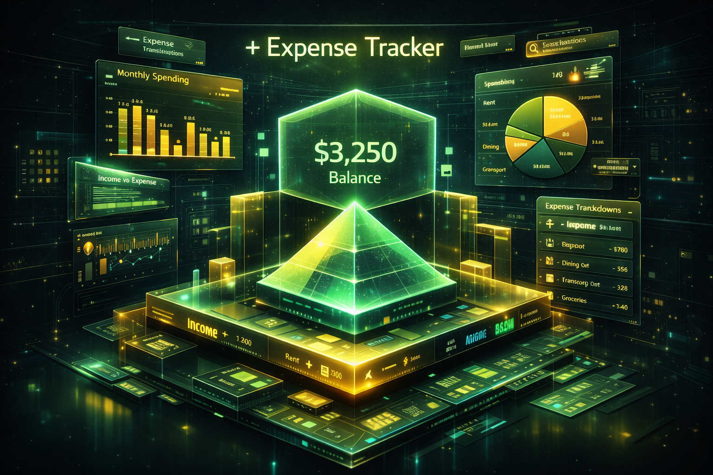
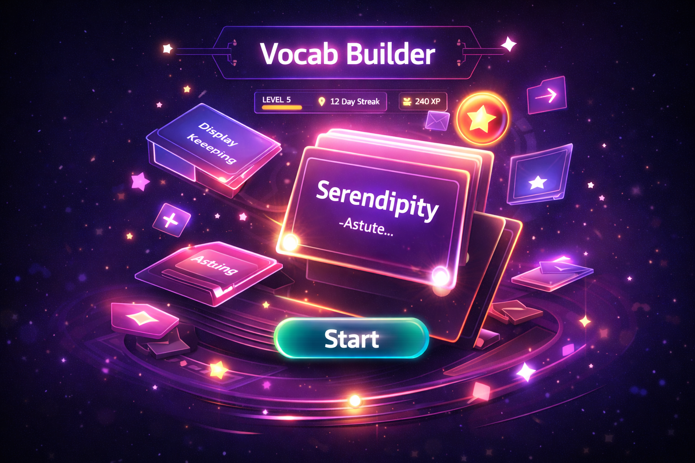
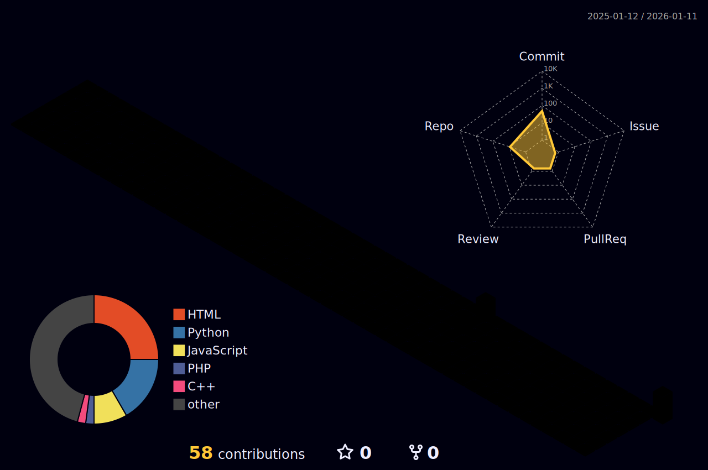

<!--
PREMIUM ULTRA MAX GOD LEVEL GITHUB PROFILE
Architected by Dhanush Hebbar
-->

<!-- ANIMATED HEADER BACKGROUND -->

<!-- DYNAMIC TYPING SVG - MULTI-LINE & FASTER -->

<!-- SOCIALS BADGES - GLOWING STYLE -->

 

<!-- MASTER GRID LAYOUT -->

<table align="center" border="0" cellpadding="0" cellspacing="0">
<tr>
<td align="left" width="55%" valign="top">

💫 About Me

"Code is poetry written for machines, but designed for humans."

I am an MCA Candidate and Full Stack Specialist operating out of Mangaluru, India. I don't simply write software; I architect resilient, scalable systems that bridge the chasm between traditional web engineering and the frontier of Artificial Intelligence.

🔭 Current Mission: Scaling StudyForge into a global EdTech standard.

🧠 Core Philosophy: Domain-Driven Design (DDD) & Clean Architecture.

🤝 Open Collaboration: Seeking advanced AI/ML, SaaS, & Open Source challenges.

🏆 Hall of Fame:

1st Prize @ Shark Tank (SDM College) - Innovation Excellence

GDG 2025 Vertex AI & Agentic AI Specialist

 

</td>
<td align="center" width="5%" valign="top">
</td>
<td align="center" width="40%" valign="top">

🎧 The Rhythm of Code

  

</td>
</tr>
</table>

<!-- THE ARSENAL SECTION - VISUAL & RESPONSIVE -->

<h2 align="center">💻 <b>Tech Stack</b></h2>

<i>"A craftsman is only as good as his tools."</i>

<!-- JOURNEY TIMELINE -->

<h2 align="center">🚀 <b>The Journey So Far</b></h2>

<table align="center" width="100%">
<tr>
<td width="50%" valign="top">
<h3>🎓 Education</h3>
<ul>
<li>
<b>MCA (Pursuing)</b> 

<i>Shree Devi Institute of Technology (2024 - 2026)</i>

Specializing in AI-Driven Software Architectures.
</li>
<li>
<b>BCA (80.39%)</b> 

<i>Padua College of Commerce (2021 - 2024)</i>

Foundation in Computer Applications & Math.
</li>
</ul>
</td>
<td width="50%" valign="top">
<h3>💼 Experience</h3>
<ul>
<li>
<b>Full Stack Developer Intern</b> 

<i>Zephyr Technologies (Mar 2024 - Apr 2024)</i>

• Engineered robust web solutions optimizing API response.

• Refactored legacy codebases for 20% better efficiency.

• Collaborated in Agile sprints for rapid delivery.
</li>
</ul>
</td>
</tr>
</table>

<!-- PROJECTS SECTION - PREMIUM CARDS WITH DEEP DIVES -->

<h2 align="center">🧬 <b>Flagship Implementations</b></h2>

<table border="0">
<tr>
<td width="600" valign="top">
<h3 align="center">🧠 StudyForge: The AI Learning Revolution</h3>

 
<blockquote>
<i>"An intelligent ecosystem where static documents evolve into interactive mentors."</i>
</blockquote>
 
<table border="0">
<tr>
<td>🔹 <b>Architecture</b></td>
<td>Micro-Modular Monolith (DDD)</td>
</tr>
<tr>
<td>🔹 <b>AI Engine</b></td>
<td>Gemini 1.5 Pro + RAG Pipeline</td>
</tr>
<tr>
<td>🔹 <b>Tech Stack</b></td>
<td><code>FastAPI</code> <code>React</code> <code>PostgreSQL</code> <code>Firebase</code></td>
</tr>
</table>

   
  
  

    
<b>🛠️ Click to View Engineering Deep Dive</b>

     
    <ul>
      <li><b>Micro-Modular Monolith:</b> Rejected microservices to eliminate network latency for the cognitive engine, ensuring sub-second AI responses.</li>
      <li><b>Resilient AI Orchestration:</b> Implemented a <b>Round-Robin Key Rotation</b> strategy to handle API rate limits gracefully without downtime.</li>
      <li><b>Hybrid Data Strategy:</b> Uses <b>PostgreSQL</b> for transactional integrity (Grades, Auth) and <b>Firebase</b> for ephemeral real-time states (Whiteboards).</li>
      <li><b>Anti-Hallucination:</b> Enforces a strict grounding policy where the AI can only cite from the user's uploaded TF-IDF vector index.</li>
    </ul>
  

</td>
<td width="20"></td>
<td width="400" valign="top">
  <!-- EXPENSE TRACKER CARD -->
  <h3 align="center">💰 Expense Tracker</h3>
  
   
  <b><i>"Secure. Visual. Insightful."</i></b>
   
  Built with the **MERN Stack**, this dashboard features complex data visualization using Chart.js and bank-grade **JWT Authentication**.
   
  

    
<b>⚙️ Tech Details</b>

    <ul>
      <li><b>Security:</b> HttpOnly Cookies & JWT.</li>
      <li><b>Performance:</b> MongoDB Aggregation Pipelines for real-time analytics.</li>
    </ul>
  

   
  

     
  

  
   
 

  <!-- VOCAB BUILDER CARD -->
  <h3 align="center">📚 Vocab Builder</h3>
  
   
  <b><i>"Gamified Learning."</i></b>
   
  Leverages **Framer Motion** for 60FPS animations and local storage persistence for offline capability.
   
  

     
  

</td>

</tr>
</table>

<!-- STATS & ACTIVITY SECTION -->

<h3 align="center">📊 <b>GitHub Stats</b></h3>

 

<h3 align="center">✍️ <b>Random Dev Quote</b></h3>

<h3 align="center">🔝 <b>Top Contributed Repo</b></h3>

 

<!-- 3D CONTRIBUTION GRAPH -->

<h3 align="center">🔥 <b>3D Contribution Graph</b></h3>

 

<!-- Proudly created with GPRM ( https://gprm.itsvg.in ) -->
